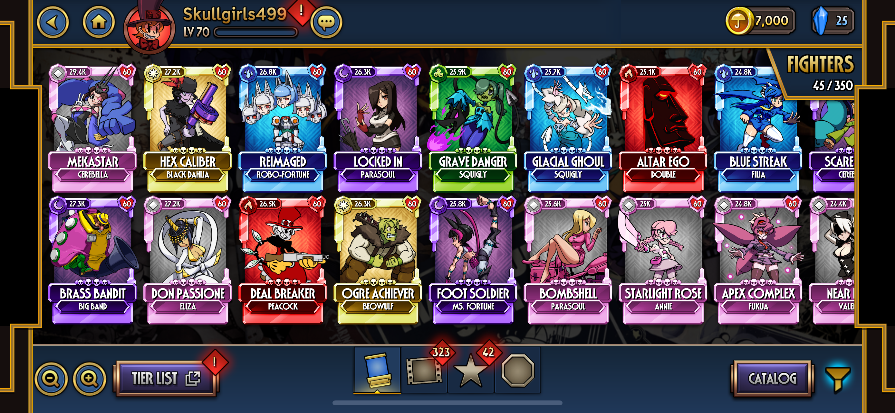
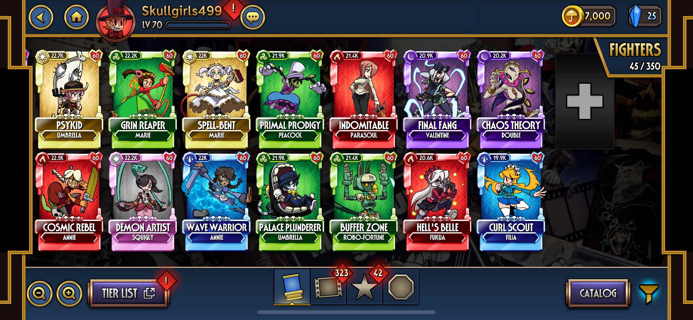
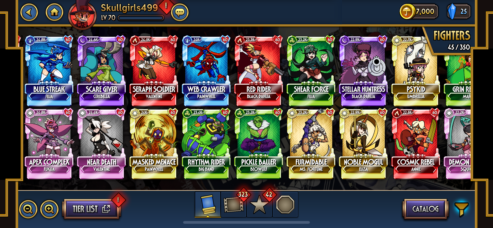
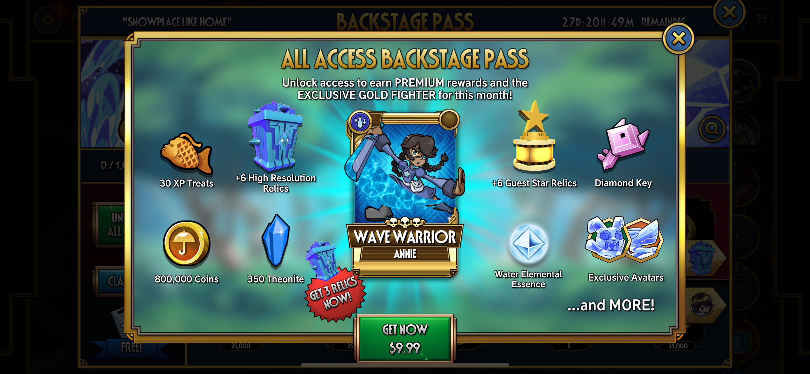
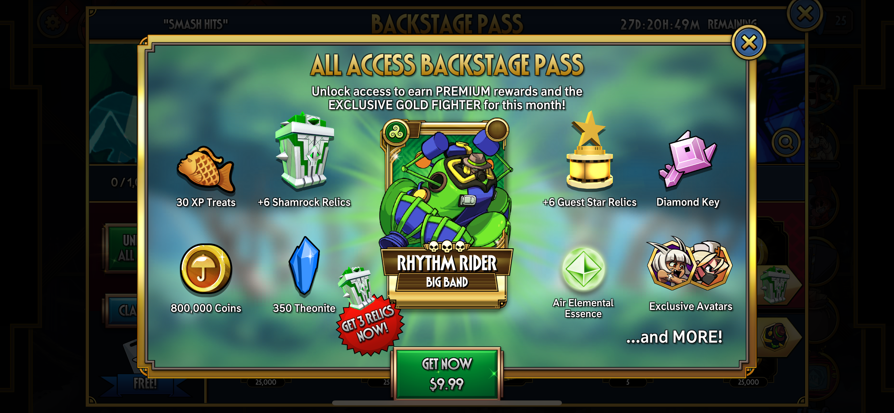

# HVS

<h1> SKULLGIRLS MOBILE (SGM)</h1>

<h2> SGM VARIANTS </h2>

This is a showcase of all 42 Variants I added to SGM.

Each of these variants had 2 Signature Abilities, altered Stats and different Element types that made them wholly unique to other Character Variants.

Additionally, higher rarity variants came with unique Visual Flourishes. Examples can be found here: <a href="https://www.youtube.com/watch?v=EwFHLaNsHsM">1</a> <a href="https://youtu.be/9sA8Di9PE-4">2</a> <a href="https://youtu.be/Oa85PSxzB8Y">3</a>.

<h2> PROMO ART AND OFFERS </h2>

 Accompanying new seasonal variants is a monthly promo art piece that we work with community artists to create, offer update(s), and a potential revamp of recurring <a href="https://skullgirlsmobile.fandom.com/wiki/Prize_Fights#Special_Event_Prize_Fights">Special Event Prize Fights</a> to keep content fresh and exciting.

